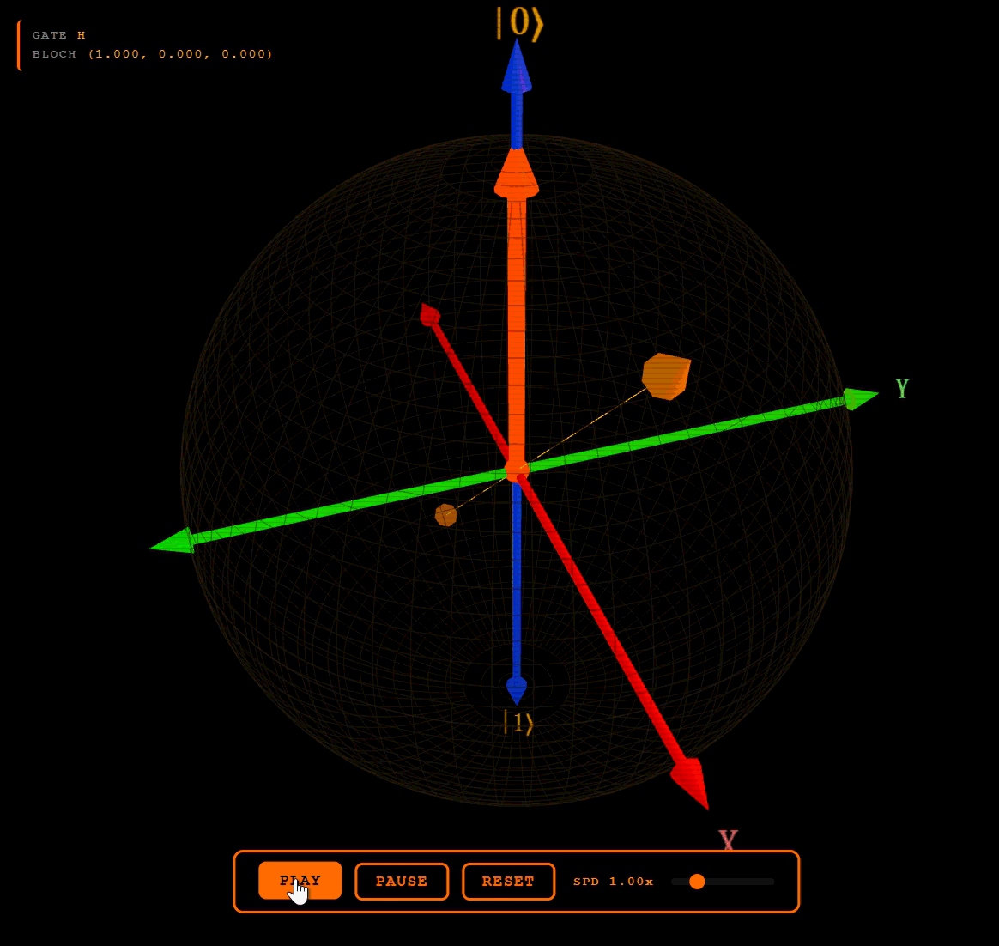
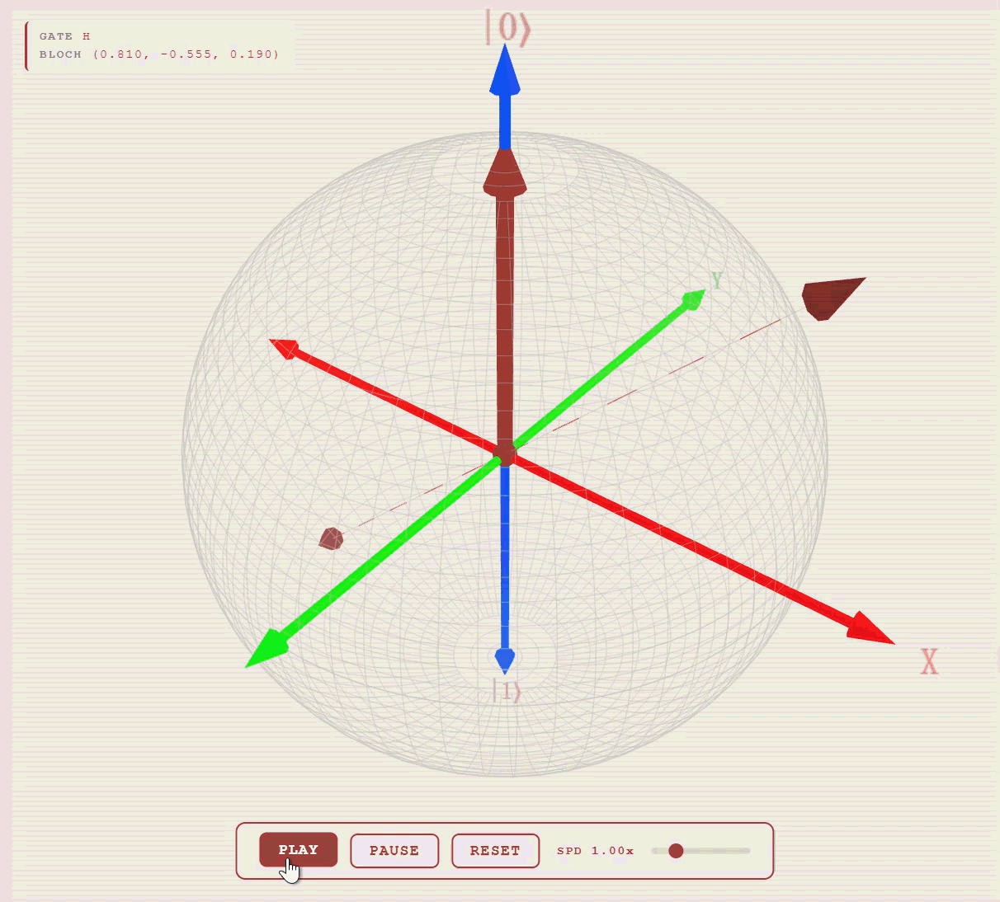
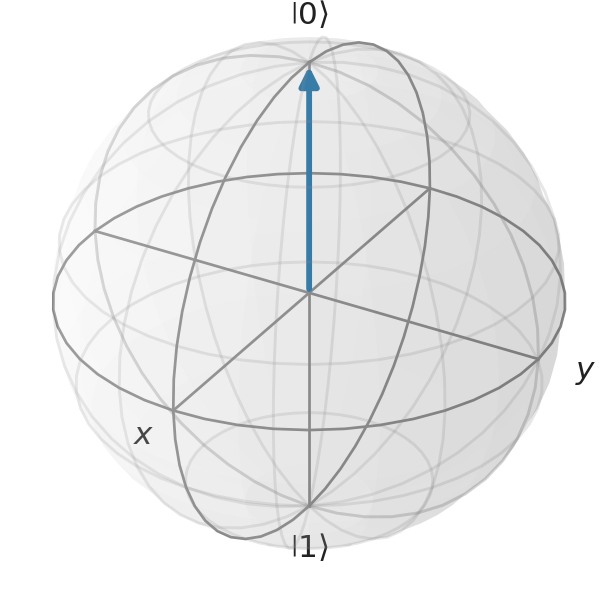
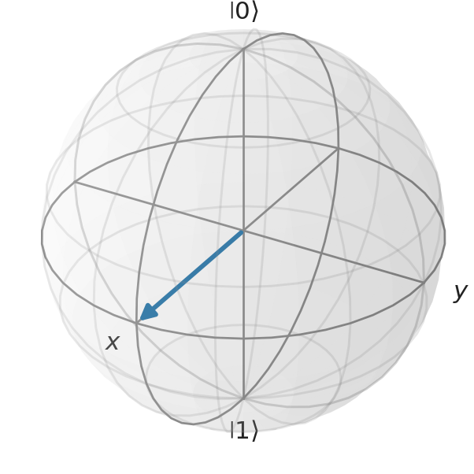

<div align="right">

**[English](./README_EN.md)** | **中文**

</div>

# 布洛赫球 — 交互式单量子比特门演化演示

基于布洛赫球的量子态与门操作交互式 3D 可视化工具。技术栈：Streamlit + QuTiP + Three.js。

---

## 功能特性

- **3D 布洛赫球**：基于 Three.js 渲染，支持鼠标旋转、缩放与平移，配有 CRT 扫描线视觉效果
- **量子门操作**：支持泡利门 X / Y / Z、阿达马门 H 及参数化旋转门 Rx / Ry / Rz，旋转门可通过滑块连续调节角度
- **多种初始态**：预设六种量子态—— $\vert 0\rangle$、 $\vert 1\rangle$、 $\vert +\rangle$、 $\vert -\rangle$、 $\vert +i\rangle$、 $\vert -i\rangle$，同时支持通过极坐标 $(\theta, \phi)$ 自定义布洛赫球面上任意初始态
- **单门模式**：逐个应用量子门，实时观测态矢量演化与轨迹弧线
- **门链模式**：自由配置多门序列，通过弹出窗口逐门设置参数，一键执行完整链路，表格展示各步中间态
- **实时数据面板**：狄拉克符号、测量概率柱状图、布洛赫坐标、门矩阵 LaTeX 渲染
- **GIF 导出**：一键生成学术风格动画 GIF，初始态以蓝色标注、轨迹以橙色高亮、末态以红色标记，适配 PPT 演示
- **双主题切换**：暗色为黑橙复古未来主义风格，亮色为暖灰色调，全局样式统一

---

## 效果展示

<div align="center">

| 单门操作（暗色） | 门链操作（暗色） |
|:---:|:---:|
|  |  |

| 单门操作（亮色） | 门链操作（亮色） |
|:---:|:---:|
|  |  |

</div>

---

## 实时动画演示

### 单门动画

应用单个量子门，实时观察态矢量的演化过程。

<div align="center">

| 暗色 | 亮色 |
|:---:|:---:|
|  |  |

</div>

### 门链动画

配置一系列量子门，观察完整的演化路径与中间态。

<div align="center">

| 暗色 | 亮色 |
|:---:|:---:|
|  |  |

</div>

---

## GIF 导出效果

应用支持将布洛赫球演化过程导出为动画 GIF。以下是各类门的导出效果。

### 单门导出

<div align="center">

| 门 | 说明 | GIF 预览 |
|------|-------------|:---:|
| X | 比特翻转：绕 $x$ 轴旋转 $\pi$ |  |
| Y | 比特相位翻转：绕 $y$ 轴旋转 $\pi$ |  |
| Z | 相位翻转：绕 $z$ 轴旋转 $\pi$ |  |
| H | 阿达马门：绕 $(x+z)/\sqrt{2}$ 轴旋转 $\pi$ |  |
| Rx | 绕 $x$ 轴旋转 $\theta = 1.97$ rad |  |
| Ry | 绕 $y$ 轴旋转 $\theta = 1.97$ rad |  |
| Rz | 绕 $z$ 轴旋转 $\theta = 1.97$ rad |  |

</div>

### 门链导出

<div align="center">

| 链 | 说明 | GIF 预览 |
|-------|-------------|:---:|
| 多门链 | 用户自定义门序列的复合演化 |  |

</div>

---

## 快速开始

### 环境要求

- [Miniforge](https://github.com/conda-forge/miniforge) 或 Anaconda

### 安装

从 [Releases](https://github.com/rAoLiK/BlochSphere/releases) 页面下载最新版本的压缩包，解压后进入项目目录：

```bash
tar -xzf BlochSphere-v2.0.tar.gz    # Linux / WSL
# 或解压 BlochSphere-v2.0.zip       # Windows
cd BlochSphere
```

**Linux / WSL：**
```bash
bash env/setup.sh
conda activate bloch
```

**Windows：**
```cmd
env\setup.bat
conda activate bloch
```

### 运行

```bash
streamlit run app.py
```

浏览器访问 http://localhost:8501。

### 运行测试

```bash
python -m pytest tests/ -v
```

---

## 使用教程

### 单门模式

「SINGLE GATE」标签页用于逐个应用量子门并观察结果。

1. 从侧边栏选择初始态： $\vert 0\rangle$、 $\vert 1\rangle$、 $\vert +\rangle$，或输入自定义极坐标 $(\theta, \phi)$。
2. 选择量子门：X, Y, Z, H, Rx, Ry, Rz。
3. 对于旋转门（Rx/Ry/Rz），使用滑块设置旋转角度。
4. 点击 APPLY 执行门操作。态矢量从初始态动画演化至末态，轨迹弧线绘制在球面上。
5. 鼠标拖拽旋转 3D 视图，滚轮缩放。球体下方的动画控件控制播放。

侧边栏实时显示当前态的狄拉克符号、测量概率和布洛赫坐标。

通过极坐标 $(\theta, \phi)$ 可设置任意初始态，探索布洛赫球面上的任意位置：


默认初始态下的基础门操作演示：


### 门链模式

「GATE CHAIN」标签页用于配置多个量子门序列并作为整体执行。

1. 点击「ADD GATE」向链中添加量子门，每个门以卡片形式显示。
2. 点击卡片配置门类型和参数。
3. 点击「APPLY CHAIN」执行完整序列。动画展示态在各门之间的演化过程，表格显示中间态。
4. 使用动画速度滑块控制播放速度。


### GIF 导出

点击侧边栏的「EXPORT GIF」生成当前演化过程的动画 GIF。生成完成后，下方出现「DOWNLOAD GIF」按钮。

- GIF 展示布洛赫球旋转以显示轨迹，初始态（蓝色）、轨迹（橙色）和末态（红色）分别标注。
- 单门模式和门链模式均可使用。

---

## 理论背景

### 布洛赫球

任意单量子比特纯态可以表示为：

$$\vert \psi\rangle = \cos\frac{\theta}{2}\vert 0\rangle + e^{i\phi}\sin\frac{\theta}{2}\vert 1\rangle$$

其中 $\theta \in [0, \pi]$ 为极角， $\phi \in [0, 2\pi)$ 为方位角。这一参数化将每个量子比特态映射到 $\mathbb{R}^3$ 中单位球面上的一个点，即布洛赫球。北极对应 $\vert 0\rangle$，南极对应 $\vert 1\rangle$，赤道态是 $\vert 0\rangle$ 和 $\vert 1\rangle$ 的等幅叠加，具有不同的相对相位。

态 $\vert \psi\rangle$ 对应的布洛赫矢量 $\mathbf{r} = (x, y, z)$ 由泡利矩阵的期望值给出：

$$x = \langle\sigma_x\rangle, \quad y = \langle\sigma_y\rangle, \quad z = \langle\sigma_z\rangle$$

对于纯态，该矢量长度为 1，位于布洛赫球表面。混态（密度矩阵满足 $\mathrm{Tr}(\rho^2) < 1$）位于球面内部。

### 量子门即旋转

单量子比特门对应布洛赫矢量的旋转。每个幺正门 $U$ 可以表示为绕某轴 $\hat{n}$ 旋转角度 $\theta$：

$$U = \exp\left(-i\frac{\theta}{2}\,\hat{n}\cdot\boldsymbol{\sigma}\right) = \cos\frac{\theta}{2}\,I - i\sin\frac{\theta}{2}\,(\hat{n}\cdot\boldsymbol{\sigma})$$

其中 $\hat{n}$ 为单位矢量， $\boldsymbol{\sigma} = (\sigma_x, \sigma_y, \sigma_z)$ 为泡利矩阵。

本应用实现的标准门及其矩阵表示：

<div align="center">

| 门 | 轴 | 角度 | 矩阵 | 说明 |
|------|------|-------|------|-------------|
| X | $\hat{x}$ | $\pi$ | $\pmatrix{0&1\\\ 1&0}$ | 比特翻转： $\vert 0\rangle \leftrightarrow \vert 1\rangle$ |
| Y | $\hat{y}$ | $\pi$ | $\pmatrix{0&-i\\\ i&0}$ | 比特相位翻转 |
| Z | $\hat{z}$ | $\pi$ | $\pmatrix{1&0\\\ 0&-1}$ | 相位翻转： $\vert 1\rangle \to -\vert 1\rangle$ |
| H | $(\hat{x}+\hat{z})/\sqrt{2}$ | $\pi$ | $\frac{1}{\sqrt{2}}\pmatrix{1&1\\\ 1&-1}$ | 产生等幅叠加 |
| Rx | $\hat{x}$ | $\theta$ | $\pmatrix{\cos\frac{\theta}{2}&-i\sin\frac{\theta}{2} \\\ -i\sin\frac{\theta}{2}&\cos\frac{\theta}{2}}$ | 绕 $x$ 轴任意角度旋转 |
| Ry | $\hat{y}$ | $\theta$ | $\pmatrix{\cos\frac{\theta}{2}&-\sin\frac{\theta}{2}\\\sin\frac{\theta}{2}&\cos\frac{\theta}{2}}$ | 绕 $y$ 轴任意角度旋转 |
| Rz | $\hat{z}$ | $\theta$ | $\pmatrix{e^{-i\theta/2}&0\\\ 0&e^{i\theta/2}}$ | 绕 $z$ 轴任意角度旋转 |

</div>

阿达马门 H 值得特别说明：它绕 $\hat{x}$ 与 $\hat{z}$ 之间倾斜 $45^\circ$ 的轴旋转 $\pi$ 角度。将 $\vert 0\rangle$ 映射到 $\vert +\rangle = (\vert 0\rangle+\vert 1\rangle)/\sqrt{2}$，将 $\vert 1\rangle$ 映射到 $\vert -\rangle = (\vert 0\rangle-\vert 1\rangle)/\sqrt{2}$。

> [!NOTE]
> **关于旋转门角度约定**
>
> 在量子计算文献中，旋转门存在两种常见的角度约定。本工程采用的是现代量子计算框架（如 QuTiP、Qiskit）中通用的标准约定：
>
> $$R_n(\theta) = \exp\left(-i\frac{\theta}{2}\,\hat{n}\cdot\boldsymbol{\sigma}\right)$$
>
> 在此约定下，参数 $\theta$ 即为布洛赫矢量在球面上的实际旋转角度。例如，设置 $\theta = \pi$ 时，布洛赫矢量恰好旋转 $\pi$，对应从北极到南极的翻转。
>
> 另一种约定将指数中的因子 $1/2$ 吸收到参数定义中，写作 $R_n(\alpha) = \exp(-i\alpha\,\hat{n}\cdot\boldsymbol{\sigma})$，此时参数 $\alpha$ 仅为实际旋转角度的一半，即 $\alpha = \theta/2$。采用该约定的文献中，实现 $\pi$ 旋转需要设置参数为 $\pi/2$。
>
> 本工程使用的第一种约定在物理直觉上更为直接：用户在界面上设置的角度值，就是布洛赫球面上的真实旋转角度，无需额外的换算。

### 态演化与轨迹

当门 $U$ 作用于态 $\vert \psi\rangle$ 时，布洛赫矢量沿球面上的一段大圆弧旋转。旋转轴为门的轴，角度为门的角度。本应用通过将旋转插值为若干小步来可视化这一过程，产生平滑动画并绘制轨迹弧。

对于门链 $U_1, U_2, \ldots, U_n$，末态为：

$$\vert \psi_{\mathrm{final}}\rangle = U_n \cdots U_2\, U_1\,\vert \psi_{\mathrm{initial}}\rangle$$

轨迹为各段弧的拼接，每个门的终点即为下一个门的起点。

### 测量与概率

当量子比特处于态 $\vert \psi\rangle = \alpha\vert 0\rangle + \beta\vert 1\rangle$ 时，在计算基下测量：

$$P(0) = \vert \alpha\vert ^2 = \cos^2\frac{\theta}{2}, \qquad P(1) = \vert \beta\vert ^2 = \sin^2\frac{\theta}{2}$$

布洛赫矢量的 $z$ 分量编码了这一信息：

$$z = \cos\theta = P(0) - P(1)$$

靠近北极（ $z \approx 1$）的态测得 0 的概率高；靠近南极（ $z \approx -1$）的态测得 1 的概率高。

---

## 项目结构

```
BlochSphere/
├── app.py                    # Streamlit 主程序入口
├── quantum/                  # 量子后端 (QuTiP)
│   ├── state.py              # BlochState 量子态类
│   ├── gates.py              # 量子门定义
│   └── evolution.py          # 动画帧生成
├── ui/                       # Streamlit UI 组件
│   ├── styles.py             # 双主题 CSS（暗色 + 亮色）
│   ├── controls.py           # 侧边栏控件
│   └── display.py            # 状态信息展示
├── visualization/            # 3D 渲染与 GIF 导出
│   ├── scene.py              # Three.js 场景构建器
│   └── gif_export.py         # Matplotlib/qutip.Bloch GIF 生成器
├── tests/                    # Pytest 测试套件
│   ├── test_state.py         # BlochState 测试
│   ├── test_apply_logic.py   # 门操作测试
│   ├── test_evolution.py     # 帧生成测试
│   └── test_scene.py         # HTML 场景测试
├── env/                      # Conda 环境配置
│   ├── environment.yml
│   ├── setup.sh
│   └── setup.bat
├── fig/                      # 截图与 GIF 演示
│   ├── gif/singlegate/       # 单门 GIF 导出
│   ├── gif/multigate/        # 门链 GIF 导出
│   └── gif/screen/           # 屏幕录制
├── LICENSE                   # MIT 许可证
├── README_EN.md              # English version
└── report/                   # 学术报告
```

---

## 技术细节

- **量子后端**：QuTiP 负责量子态表示与门操作计算。BlochState 封装 QuTiP `Qobj`（ $2\times1$ ket），提供概率计算、布洛赫矢量提取和门应用方法。
- **3D 渲染**：Three.js v0.160.0（CDN importmap 加载）通过 `st.iframe()` 嵌入 Streamlit。所有 3D 几何体、动画控件和 CRT 扫描线效果均在 `visualization/scene.py` 生成的单一 HTML 模板中。
- **动画机制**：Python 通过分步旋转门操作计算 $(x,y,z)$ 帧序列，Three.js 在客户端渲染。速度参数控制帧率。
- **GIF 导出**：使用 `qutip.Bloch`（matplotlib）配合 `FuncAnimation` 和 `PillowWriter`。生成学术风格 GIF，包含轨迹弧线、颜色编码的初末态和平滑插值。
- **样式系统**：CSS 自定义属性实现主题切换。所有组件样式在基础模板中定义；`light_overrides` 仅包含文字/背景色调整。弹出窗口/对话框 portal 需要显式的 `[data-baseweb="popover"]` CSS 规则。

---

## 依赖

通过 conda 统一管理（`env/environment.yml`）：

<div align="center">

| 包 | 用途 |
|---------|---------|
| Python 3.10 | 运行时 |
| QuTiP | 量子态与门操作数学 |
| NumPy / SciPy | 数值计算 |
| Matplotlib | GIF 渲染后端 |
| Pillow | GIF 编码 |
| Streamlit | Web UI 框架 |

</div>

---

## 许可

本项目基于 MIT 许可证开源。详见 [LICENSE](./LICENSE)。
