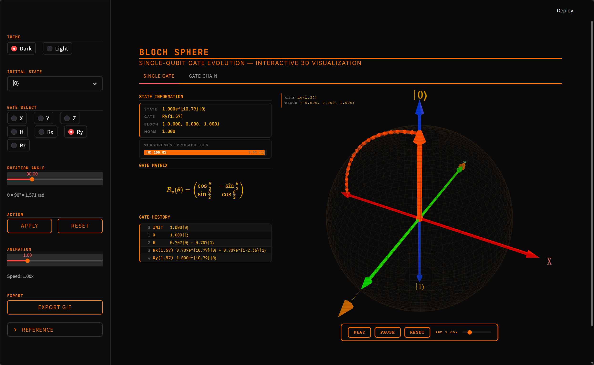
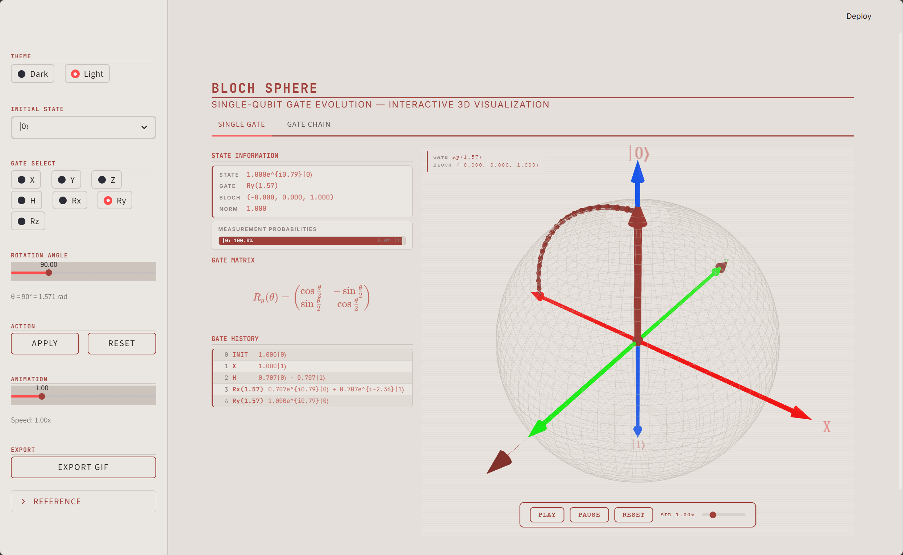
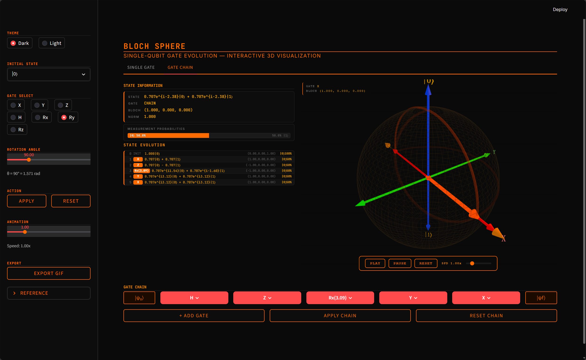
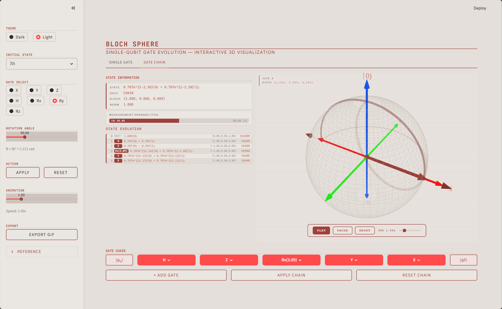
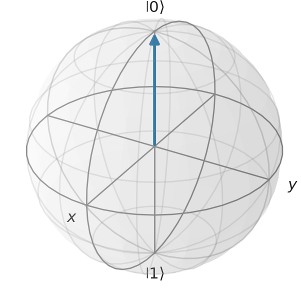

# 布洛赫球 — 交互式单量子比特门演化演示

基于布洛赫球的量子态与门操作交互式 3D 可视化工具。技术栈：Streamlit + QuTiP + Three.js。

---

## 功能特性

- 3D 布洛赫球，支持鼠标旋转、缩放、平移
- 量子态矢量在门操作下的平滑动画演化
- 轨迹弧线记录并展示量子态在球面上的演化路径
- 支持门类型：X, Y, Z（泡利门）、H（阿达马门）、Rx, Ry, Rz（参数化旋转门）
- 初始态选择：|0>、|1>、|+>，或自定义极坐标 (theta, phi)
- 多门链模式：配置并执行一系列量子门，显示中间态
- 实时数据面板：狄拉克符号、测量概率、布洛赫坐标
- GIF 导出：生成适合演示文稿的动画 GIF
- 双主题：暗色（复古未来主义黑橙）和亮色（暖灰）

---

## 效果展示

### 暗色模式 — 单门操作



### 亮色模式 — 单门操作



### 暗色模式 — 门链操作



### 亮色模式 — 门链操作



---

## 快速开始

### 环境要求

- [Miniforge](https://github.com/conda-forge/miniforge) 或 Anaconda
- Git

### 安装

**Linux / WSL：**
```bash
git clone https://github.com/<your-username>/Bloch_v4.git
cd Bloch_v4
bash env/setup.sh
conda activate bloch
```

**Windows：**
```cmd
git clone https://github.com/<your-username>/Bloch_v4.git
cd Bloch_v4
env\setup.bat
conda activate bloch
```

### 运行

```bash
streamlit run app.py
```

浏览器访问 http://localhost:8501。

### 运行测试

```bash
python -m pytest tests/ -v
```

---

## 使用教程

### 单门模式

「SINGLE GATE」标签页用于逐个应用量子门并观察结果。

1. 从侧边栏选择初始态：|0>、|1>、|+>，或输入自定义极坐标 (theta, phi)。
2. 选择量子门：X, Y, Z, H, Rx, Ry, Rz。
3. 对于旋转门（Rx/Ry/Rz），使用滑块设置旋转角度。
4. 点击 APPLY 执行门操作。态矢量从初始态动画演化至末态，轨迹弧线绘制在球面上。
5. 鼠标拖拽旋转 3D 视图，滚轮缩放。球体下方的动画控件控制播放。

侧边栏实时显示当前态的狄拉克符号、测量概率和布洛赫坐标。



### 门链模式

「GATE CHAIN」标签页用于配置多个量子门序列并作为整体执行。

1. 点击「ADD GATE」向链中添加量子门，每个门以卡片形式显示。
2. 点击卡片配置门类型和参数。
3. 点击「APPLY CHAIN」执行完整序列。动画展示态在各门之间的演化过程，表格显示中间态。
4. 使用动画速度滑块控制播放速度。


### GIF 导出

点击侧边栏的「EXPORT GIF」生成当前演化过程的动画 GIF。生成完成后，下方出现「DOWNLOAD GIF」按钮。

- GIF 展示布洛赫球旋转以显示轨迹，初始态（蓝色）、轨迹（橙色）和末态（红色）分别标注。
- 单门模式和门链模式均可使用。

---

## 理论背景

### 布洛赫球

任意单量子比特纯态可以表示为：

|psi> = cos(theta/2) |0> + e^(i*phi) sin(theta/2) |1>

其中 theta in [0, pi] 为极角，phi in [0, 2*pi) 为方位角。这一参数化将每个量子比特态映射到 R^3 中单位球面上的一个点，即布洛赫球。北极对应 |0>，南极对应 |1>，赤道态是 |0> 和 |1> 的等幅叠加，具有不同的相对相位。

态 |psi> 对应的布洛赫矢量 (x, y, z) 由泡利矩阵的期望值给出：

x = <sigma_x>,  y = <sigma_y>,  z = <sigma_z>

对于纯态，该矢量长度为 1，位于布洛赫球表面。混态（密度矩阵满足 Tr(rho^2) < 1）位于球面内部。

### 量子门即旋转

单量子比特门对应布洛赫矢量的旋转。每个幺正门 U 可以表示为绕某轴 n 旋转角度 theta：

U = exp(-i * theta/2 * n . sigma) = cos(theta/2) I - i sin(theta/2) (n . sigma)

其中 n 为单位矢量，sigma = (sigma_x, sigma_y, sigma_z) 为泡利矩阵。

本应用实现的标准门：

| 门 | 轴 | 角度 | 说明 |
|------|------|-------|-------------|
| X | x | pi | 比特翻转：|0> <-> |1> |
| Y | y | pi | 比特相位翻转 |
| Z | z | pi | 相位翻转：|1> -> -|1> |
| H | (x+z)/sqrt(2) | pi | 产生等幅叠加 |
| Rx(theta) | x | theta | 绕 x 轴任意角度旋转 |
| Ry(theta) | y | theta | 绕 y 轴任意角度旋转 |
| Rz(theta) | z | theta | 绕 z 轴任意角度旋转 |

阿达马门 H 值得特别说明：它绕 x 与 z 之间倾斜 45 度的轴旋转 pi 角度。将 |0> 映射到 |+> = (|0>+|1>)/sqrt(2)，将 |1> 映射到 |-> = (|0>-|1>)/sqrt(2)。

### 态演化与轨迹

当门 U 作用于态 |psi> 时，布洛赫矢量沿球面上的一段大圆弧旋转。旋转轴为门的轴，角度为门的角度。本应用通过将旋转插值为若干小步来可视化这一过程，产生平滑动画并绘制轨迹弧。

对于门链 U_1, U_2, ..., U_n，末态为：

|psi_final> = U_n ... U_2 U_1 |psi_initial>

轨迹为各段弧的拼接，每个门的终点即为下一个门的起点。

### 测量与概率

当量子比特处于态 |psi> = alpha|0> + beta|1> 时，在计算基下测量：

- 测得 0 的概率：P(0) = |alpha|^2 = cos^2(theta/2)
- 测得 1 的概率：P(1) = |beta|^2 = sin^2(theta/2)

布洛赫矢量的 z 分量编码了这一信息：z = cos(theta) = P(0) - P(1)。靠近北极（z 接近 1）的态测得 0 的概率高，靠近南极（z 接近 -1）的态测得 1 的概率高。

---

## 项目结构

```
Bloch_v4/
├── app.py                    # Streamlit 主程序入口
├── quantum/                  # 量子后端 (QuTiP)
│   ├── state.py              # BlochState 量子态类
│   ├── gates.py              # 量子门定义
│   └── evolution.py          # 动画帧生成
├── ui/                       # Streamlit UI 组件
│   ├── styles.py             # 双主题 CSS（暗色 + 亮色）
│   ├── controls.py           # 侧边栏控件
│   └── display.py            # 状态信息展示
├── visualization/            # 3D 渲染与 GIF 导出
│   ├── scene.py              # Three.js 场景构建器
│   └── gif_export.py         # Matplotlib/qutip.Bloch GIF 生成器
├── tests/                    # Pytest 测试套件
│   ├── test_state.py         # BlochState 测试
│   ├── test_apply_logic.py   # 门操作测试
│   ├── test_evolution.py     # 帧生成测试
│   └── test_scene.py         # HTML 场景测试
├── env/                      # Conda 环境配置
│   ├── environment.yml
│   ├── setup.sh
│   └── setup.bat
├── fig/                      # 截图与 GIF 演示
│   ├── gif/singlegate/       # 单门 GIF 导出
│   ├── gif/multigate/        # 门链 GIF 导出
│   └── gif/screen/           # 屏幕录制
└── report/                   # 学术报告
```

---

## 技术细节

- **量子后端**：QuTiP 负责量子态表示与门操作计算。BlochState 封装 QuTiP Qobj（2x1 ket），提供概率计算、布洛赫矢量提取和门应用方法。
- **3D 渲染**：Three.js v0.160.0（CDN importmap 加载）通过 `st.iframe()` 嵌入 Streamlit。所有 3D 几何体、动画控件和 CRT 扫描线效果均在 `visualization/scene.py` 生成的单一 HTML 模板中。
- **动画机制**：Python 通过分步旋转门操作计算 (x,y,z) 帧序列，Three.js 在客户端渲染。速度参数控制帧率。
- **GIF 导出**：使用 qutip.Bloch（matplotlib）配合 FuncAnimation 和 PillowWriter。生成学术风格 GIF，包含轨迹弧线、颜色编码的初末态和平滑插值。
- **样式系统**：CSS 自定义属性实现主题切换。所有组件样式在基础模板中定义；`light_overrides` 仅包含文字/背景色调整。弹出窗口/对话框 portal 需要显式的 `[data-baseweb="popover"]` CSS 规则。

---

## 依赖

通过 conda 统一管理（`env/environment.yml`）：

| 包 | 用途 |
|---------|---------|
| Python 3.10 | 运行时 |
| QuTiP | 量子态与门操作数学 |
| NumPy / SciPy | 数值计算 |
| Matplotlib | GIF 渲染后端 |
| Pillow | GIF 编码 |
| Streamlit | Web UI 框架 |

---

## 许可

本项目仅用于教学目的。
